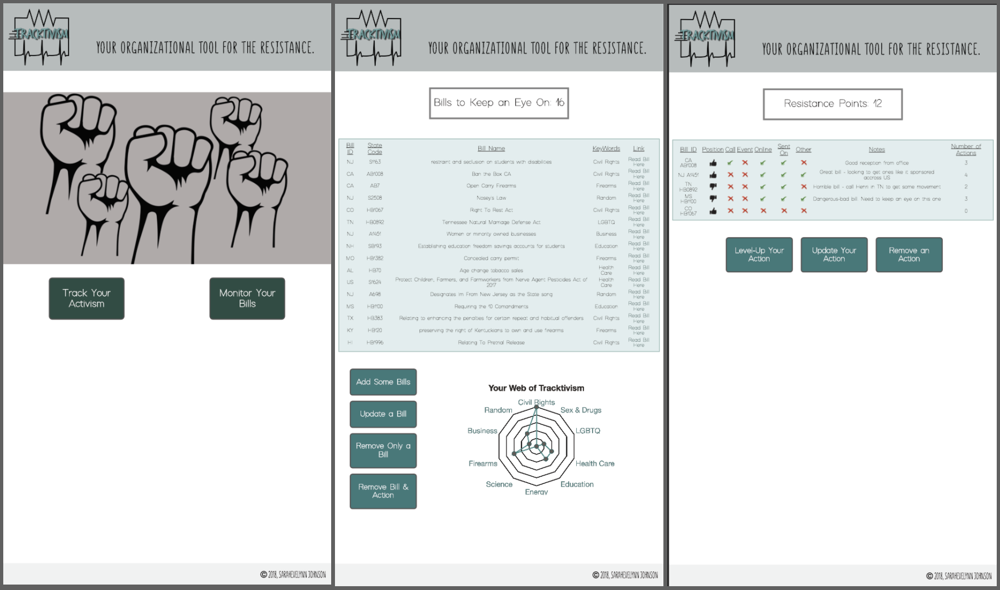

# Tracktivism

#### Author **SarahEvelynn Johnson**
#### Contact **SarahEvelynnJohnson@gmail.com**

In this app, you will find your organizational tool for the resistance. Use this app to search and log bills you care about, have their links and information in one place and categorize your activism throughout the resistance.

## Monitor Bills Tracking
* Reads from the LegiNation API to search for bills in states you care about or nationally
    * Bill ID
    * State
    * Bill Name
    * Keywords
    * Link to bill
* Add, update or remove bill (have option to remove bill and action at one time)
* See graphical representation of the bills and subjects you care about

## Track Your Activism
* Select a bill from the bills you are monitoring
* Input your opinion on a bill: support, oppose or neutral.
* Track your different forms of activism in one place
    * Made a call
    * Went to an event
    * Engaged Online
    * Sent it on to someone else who would care about it
    * Other - something else not listed here
* List any special notes so that you can keep track of all of the crazy things happening in our country now days.
* Add, update or remove actions
* Get resistance points for the actions you catalog!

## App Layout

- Link to:[deployed front-end URL](https://tracktivism.herokuapp.com/)
- Link to: [deployed API URL](https://tracktivism-data.herokuapp.com/)
- Link to: [Code Frontend Repo](https://github.com/sarahevelynn/tracktivism-frontend) & [Code Backend Repo](https://github.com/sarahevelynn/tracktivism-backend)

## Licensure
MIT License

Copyright (c) 2018 SarahEvelynn Johnson

Permission is hereby granted, free of charge, to any person obtaining a copy
of this software and associated documentation files (the "Software"), to deal
in the Software without restriction, including without limitation the rights
to use, copy, modify, merge, publish, distribute, sublicense, and/or sell
copies of the Software, and to permit persons to whom the Software is
furnished to do so, subject to the following conditions:

The above copyright notice and this permission notice shall be included in all
copies or substantial portions of the Software.

THE SOFTWARE IS PROVIDED "AS IS", WITHOUT WARRANTY OF ANY KIND, EXPRESS OR
IMPLIED, INCLUDING BUT NOT LIMITED TO THE WARRANTIES OF MERCHANTABILITY,
FITNESS FOR A PARTICULAR PURPOSE AND NONINFRINGEMENT. IN NO EVENT SHALL THE
AUTHORS OR COPYRIGHT HOLDERS BE LIABLE FOR ANY CLAIM, DAMAGES OR OTHER
LIABILITY, WHETHER IN AN ACTION OF CONTRACT, TORT OR OTHERWISE, ARISING FROM,
OUT OF OR IN CONNECTION WITH THE SOFTWARE OR THE USE OR OTHER DEALINGS IN THE
SOFTWARE.
